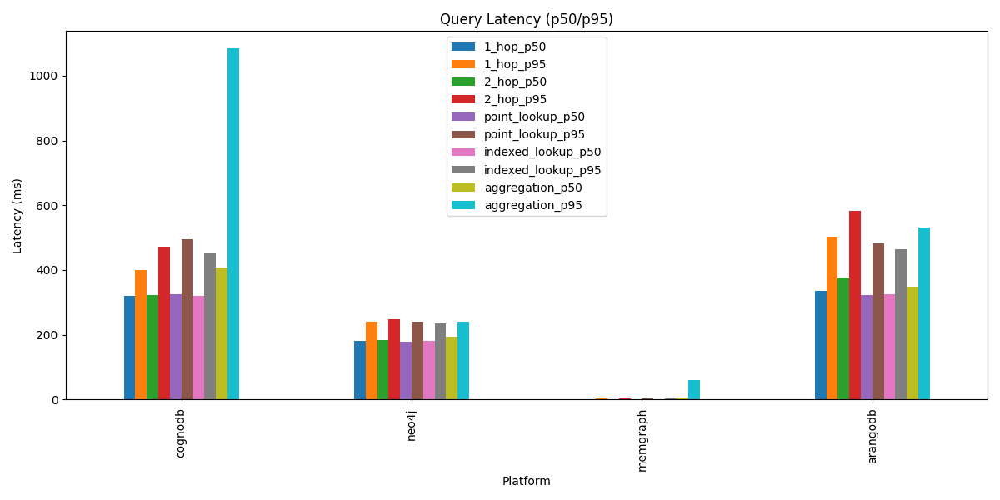
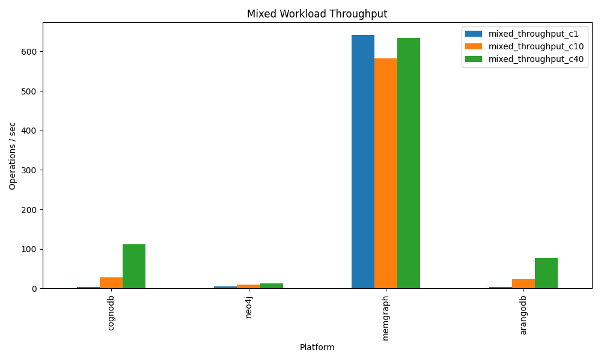

# CognoDB Benchmark Suite

This repository contains an automated, reproducible benchmark suite comparing **CognoDB Cloud** against 4 other managed graph databases under identical resource constraints.

## Methodology

*   **Dataset**: Synthetic social network graph (soc-Pokec profile), ~100k relationships.
*   **Workloads**: 1/2/3-hop traversals, point lookups, aggregations, mixed concurrency (reads + writes).
*   **Resources**: All platforms tested on roughly 0.5 vCPU / 256 MB RAM / 1 GB storage.
*   **Warm-up**: 10 warmup iterations per query.
*   **Runs**: 100 iterations post-warm-up for stable percentiles.

## Results Matrix

| Platform   |   1_hop_p50 |   1_hop_p95 |   2_hop_p50 |   2_hop_p95 |   point_lookup_p50 |   point_lookup_p95 |   indexed_lookup_p50 |   indexed_lookup_p95 |   aggregation_p50 |   aggregation_p95 |   mixed_throughput_c1 |   mixed_throughput_c10 |   mixed_throughput_c40 |
|:-----------|------------:|------------:|------------:|------------:|-------------------:|-------------------:|---------------------:|---------------------:|------------------:|------------------:|----------------------:|-----------------------:|-----------------------:|
| cognodb    |  319.877    |   400.465   |  323.689    |   472.641   |         325.858    |          494.966   |            320.282   |            452.599   |         406.67    |         1083.51   |                   3.1 |                   28.1 |                  112.4 |
| neo4j      |  181.871    |   239.705   |  184.877    |   248.996   |         179.594    |          239.866   |            181.496   |            234.232   |         194.767   |          240.238  |                   5.3 |                   10.3 |                   12.4 |
| memgraph   |    0.630975 |     2.49524 |    0.708103 |     2.73421 |           0.612378 |            3.19792 |              1.13666 |              2.67317 |           7.20406 |           61.1525 |                 641.3 |                  583   |                  634.6 |
| arangodb   |  335.62     |   501.658   |  376.97     |   581.483   |         321.662    |          481.963   |            325.7     |            462.953   |         349.554   |          531.569  |                   3   |                   24   |                   77.1 |

## Caveats and Observations

*   **Free-Tier Throttling**: Some cloud platforms aggressively throttle sustained reads. P95 metrics reflect these spikes.
*   **Language Differences**: ArangoDB uses AQL, which has slightly different query planning overhead compared to Cypher/Bolt.
*   **Cold Starts**: Serverless or auto-pausing platforms (if any) showed significantly higher latencies on the first few queries.

## Charts

